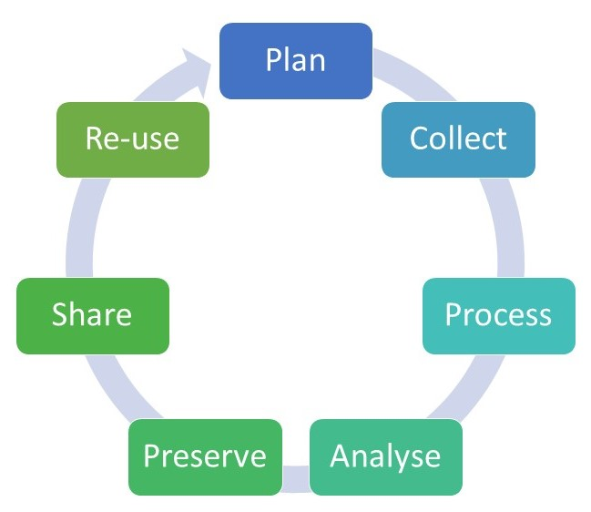
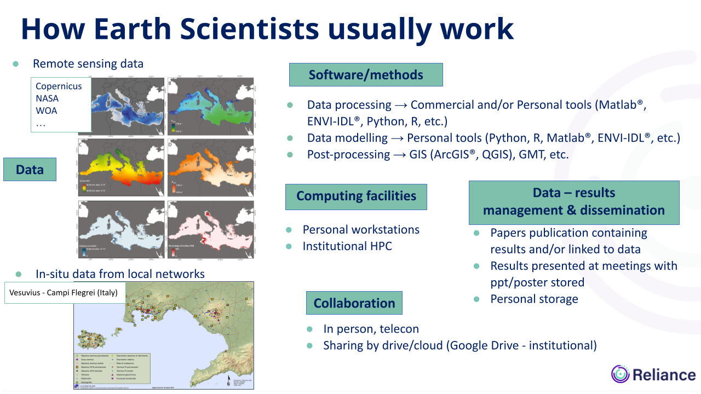

# Discussion on current working practices and bottlenecks

## Identifying current practices

## An additional burden for scientists or an opportunity

As a whole classroom or in small groups (3-4) depending on the total number of participants.

- What are the current practices?
- What are the current bottlenecks?
- Are FAIR and Open Science practices an additional burden or an opportunity ?

The main goal of this exercise is to understand the current practices of researchers (how they effectively work in their lab) with a goal to express the main bottlenecks.

- You can use the figure below that sketches the research life cycle:

You can also use the slide below as a guidance of the different categories to consider:

And you can also consider the following list of questions:

- How do you on-board newcomers in your team?
- How do you retain knowledge and practices when a postdoc, PhD, staff leaves your team? Have you established off-boarding procedures?
- Have you established specific guidelines in your team or are you using the general guidelines of your university/organization?
- Does your University/organization provide tools and services to facilitate the publication of data, software, workflows, etc.?
- What data are you using on a regular basis? 
- Where do you store data you are currently using in a project? Do you need to apply for storage quota and if yes how do you proceed?
- What software/methods are you using? Are they developed within your team or are you using commercial or Open source software (maintained by others)? How do you report bugs or make feature requests?
- Do you work on your laptop only? Or on University/organisation servers? Or on the cloud?
- Are you using computational and/or storage resources managed by your University, national provider or commercial cloud providers? Are you able to install any software/libraries you would need? How much time do you normally wait to before it available?
- When publishing scientific papers, do you also link to data, software, workflows? 
- Where do you publish your data, software, workflows, presentations, etc.?
- Is your University/organisation taking into account all your contributions or only scientific papers published in some journals?
- How do you collaborate? With internal collaborators? With external collaborators? 

