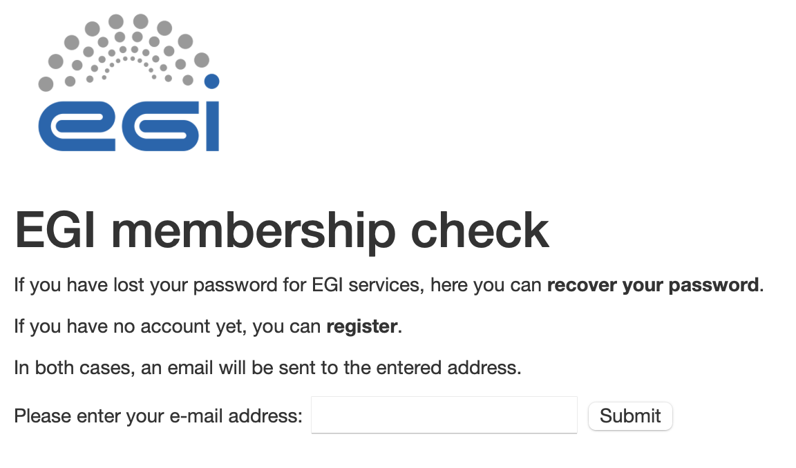
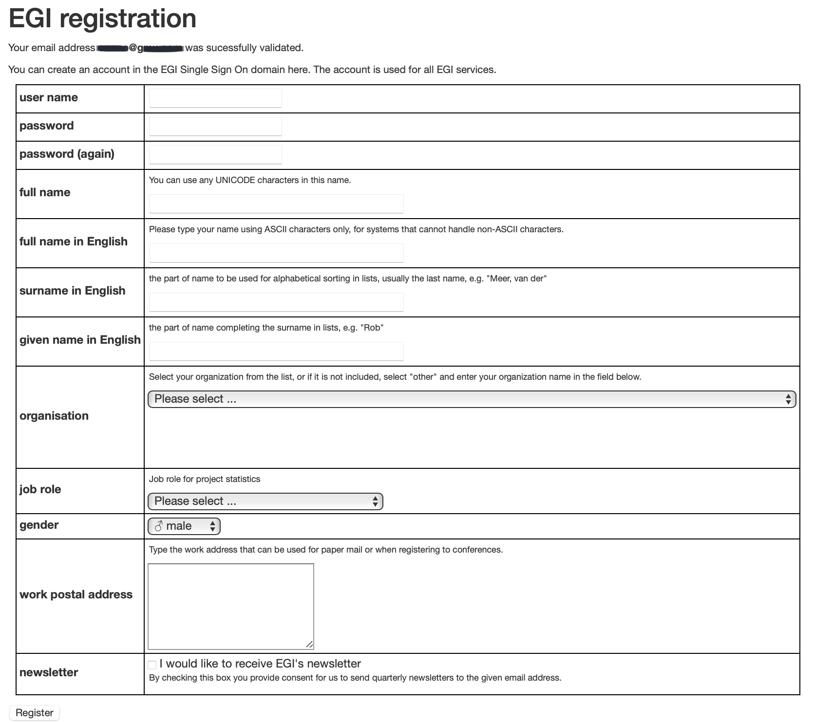
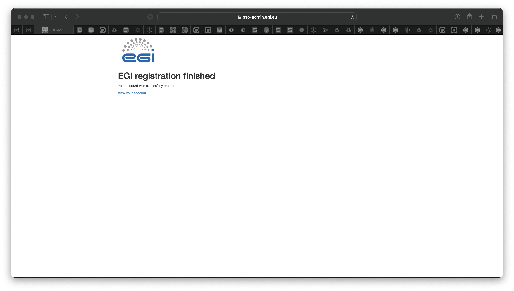
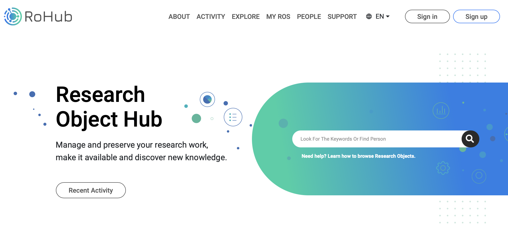
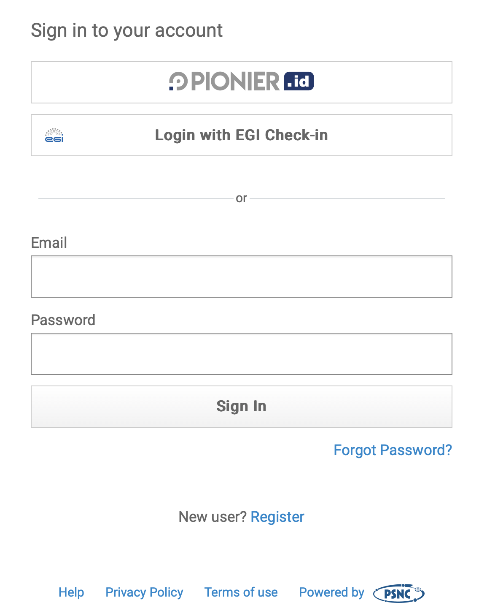
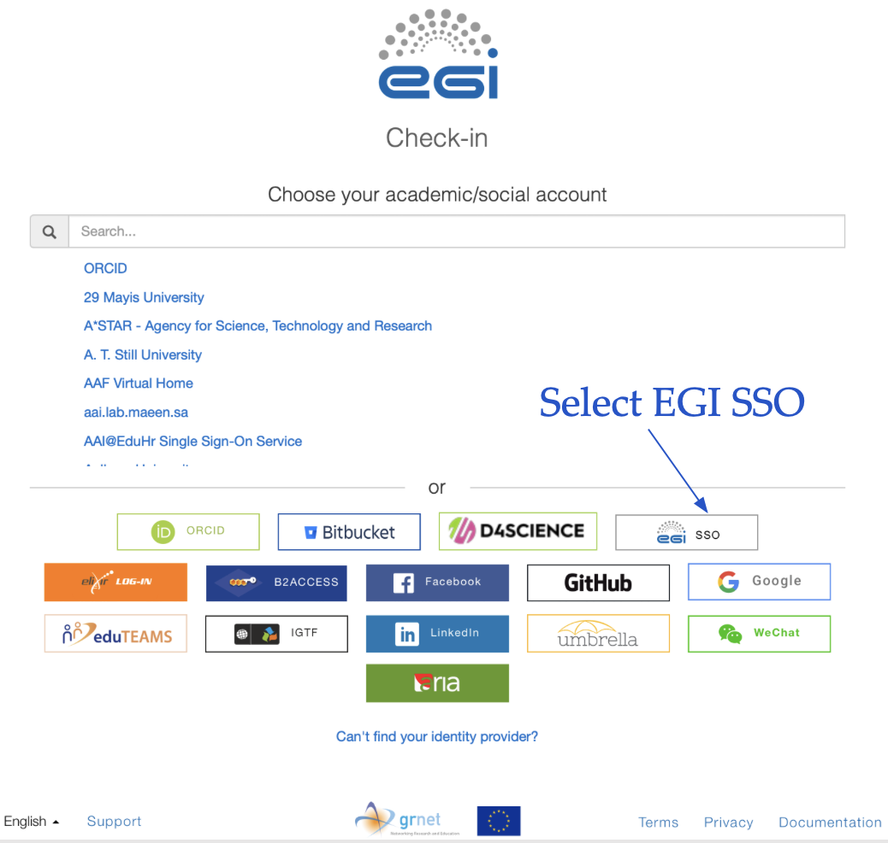
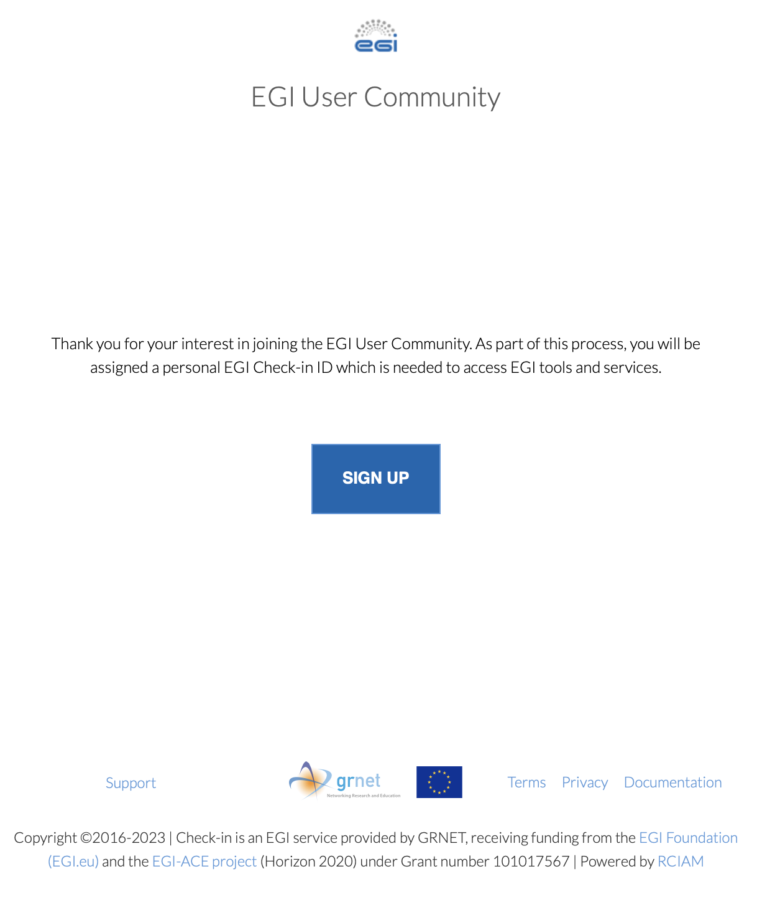
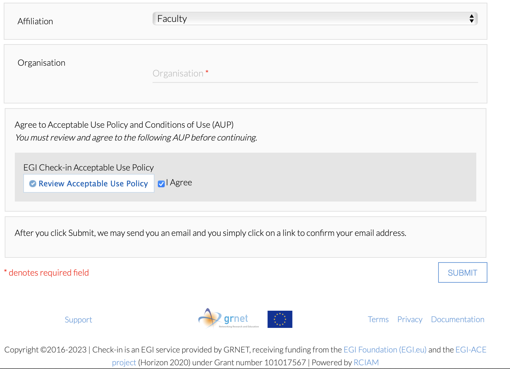

# Registration & Access to ROHub, the Research Object Hub 

To access ROHub, we will be using EGI Check-in so we first need to register to EGI Check-in:

## Registration to EGI Check-in with EGI SSO

- Go to https://sso-admin.egi.eu/admin/email

- Enter your email address and press **submit**. You will receive an email to the address you entered (check you spam folder too).
  Follow the instructions given in the email e.g. click on the link provided to validate your email address.

- Fill the form and make sure you only user lower case when choosing a user name. When filled, click on **register**.

- If successful, you should get:

## Registration to ROHub

- Go to https://www.rohub.org and click on **Sign up**

- Click on **Login with EGI Check-in**

- EGI Check-in supports different types of authentication methods. For simplicity, we suggest to select **EGI SSO** (Single Sign On)

- Enter your EGI SSO user name and password, review the provided information and click on "**Accept**" (make sure you select the option **ask me again if information to be provided to this service changes**).

- You should get the following screen and you can then click on **SIGN UP**

- It may take a few seconds and then your personal information will be displayed and you will be invited to review and accept the rohub policy.

- In the next screen, click **yes** to **Grant Access to ROHub SSO**. Review [Terms of Use](https://reliance.rohub.org/about?terms_of_service) and read and agree to [Privacy Policy](https://reliance.rohub.org/about?priv_policy)

- If successful then you should be re-directed to the main page of [https://www.rohub.org](https://www.rohub.org) and you can check you are login at the top right corner of the page (your name should be there).

- You are now ready and can use ROHub!

